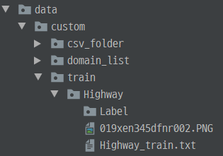

# CCAI_Pytorch 
This repository is for domain-specific object detection training framework based on Open Image dataset,

** This project Use OIDv4 toolkit. if you want to know more about it, refer to https://github.com/EscVM/OIDv4_ToolKit

** This project tested with yolov3 custom training, if you want to train with other model, then fix the model.py code  

The purpose of this project is to implement a framework that automatically downloads and learns a dataset based on a user-specified class.


###Environment 
Ubuntu 18.04  
CUDA Toolkit 10.0 with the 410 version of the NVidia Driver  
Python 3.6  
GPU : NVidia rtx 2080 ti (8GB)


### Clone and install requirements
    1. git clone "this repository" 
    2. cd CCAI
    3. sudo pip install -r requirements.txt
### Download pre-trained weights  (if you want train with yolov3 pre-trained weight)
    $ cd weights/
    $ bash download_weights.sh
### Set the domains.txt file 
Each line of domains.txt means one domain.  
First term in each line is domain name, and other are class name.  
You can find downloadable class names in domain_list.csv.  
   
For example, if you set domains.txt as below, then you can get Highway, Park domain models trained with [Car, Bus], [Person, Tree, Dog] data  


##  Parser setting and run 
There are several parsers that need to be configured for downloading data, and training model 

####[ For download dataset ]  
command :   
download - only download dataset   
train - only train model   
all - download the dataset, then train domain model  

--n_threads : set number of thread for downloading dataset  

--classes : set the path of domains.txt file


####[ For training ]  
batch_size : set your training batch_size 
model_def : only config if you want to train with your specific model.cfg file, if you don't set, then trained with 'yolov3.cfg'  
(see 34 or 55 line in main.py)


####[ Run main.py  example ]  
##### For download & train 
    $ python main.py all --classes domains.txt --limit 10000 --n_threads 60 --batch_size 8 --epochs 100 --pretrained_weights weights/yolov3.weights
##### For only download 
    $ python main.py downloader --classes domains.txt --limit 10000 --n_threads 60 
##### For only training (if dataset is already prepared) 
    $ python main.py train --batch_size 8 --epochs 200 
    


#### Tensorboard
Track training progress in Tensorboard:
* Initialize training
* Run the command below
* Go to http://localhost:6006/

```
$ tensorboard --logdir='logs' --port=6006
```

Storing the logs on a slow drive possibly leads to a significant training speed decrease.

You can adjust the log directory using `--logdir <path>` when running `tensorboard` or the `train.py`.

##Flowchart
  

① - 'bounding_boxes' class is data downloading class, it calls downloader.py  

② - 'download_img' method parsing the open-image csv file, and get image from asw server  

③ - 'get_label' method parsing the csv file, and make label data about image. You can modify this code to get the label data for your purpose.  

④ - 'Make_domain_list' method  make name file, which contains class name  
#####After ②③④, we can get the directory list as below  
  
and train.txt, valid.txt, highway.name files are made.  
train.txt, valid.txt files contain the path of image datasets  

⑤ - based on domain's class number, 'Get_group_cfg' method generate the custom yolo-cfg file. you should create create_cfg shell file, and modify get_group_cfg method if you want to get model config file on your purpose  

⑥ - model.py parse the model_cfg file, and create the model, and return it to Train.py. you should modify model.py if you want to train with your own model  

⑦ - ListDataset class' input is train.txt file path. It parses the dataset path from train.txt file, not only image path, but for Label data path
   
⑧ - train.py load the model and data from 6 and 7, and train the model for each domain, and save the pth file in weights/custom_weight/domain


## Dataset setting for Yolov3 training 
if you want to use other dataset, not open-Image dataset, 
you should follow below process (if not, you just follow above command in "Run main.py example")

#### Classes
Add class name file to `data/custom/domain_list/[classes.name]`. This file should have one row per class name. like as below  
  

#### Image Folder
Move the images of your dataset to `data/custom/train/[model domain name]`, `data/custom/validation/[model domain name]`, like directory example picture that shown above. Also, you should make train.txt file and valid.txt file as below 
  
  
but actually, you don't have to save the file in this directory. just write the train.txt, and valid.txt file path on "config/custom_data/[domain.data]" file   


#### Annotation Folder
Save your annotations to `data/custom/train/[your domain]/Labels/`, and `data/custom/validation/[your domain]/Labels/.  

The dataloader expects that the annotation file corresponding to the image `data/custom/train/[your domain]/train.jpg` has the path `data/custom/train/[your_domain]/Labels/train.txt`.  

If you want to train the data with yolov3 model, each row in the annotation file should define one bounding box, using the syntax `label_idx x_center y_center width height`. The coordinates should be scaled `[0, 1]`, and the `label_idx` should be zero-indexed and correspond to the row number of the class name in `data/custom/classes.names`.

#### Make data file 
make data file at config/custom_data/ like as below  
  
classes : number of domain's class number   
train : path of train.txt file   
valid : path of valid.txt file   
names : path of .name file 


#### Train
To train on the custom dataset run:

you should make model_cfg file for your custom data file.  
```
cd config/custom_cfg 
bash create_custom_model.sh [class number]
```
then you can get your custom cfg file for yolov3 training.
and run command below  
```
$ python3 main.py --model_def config/yolov3-custom.cfg --batch_size 8 --epochs 200
```

Add `--pretrained_weights weights/darknet53.conv.74` to train using a backend pretrained on ImageNet.


## Detection test with trained model
before test, you should change the yolov3-custom.cfg file like below.  
 

parser setting for detect test is as below: 
 
--image_folder : put the directory path where your test data files stored  
--model_def : cfg_file   
--weights_path : put the trained model with your custom data ex: weights/custom_weight/Highway.pth  
--class_path : name file path ex: data/custom/domain_list/Highway.name 

#####Run detect.py example  

    $ python detect.py --image_folder data/sample --model_def config/custom_cfg/yolov3-custom.cfg --weights_path weights/custom_weight/Highway.pth --class_path data/custom/domain_list/Highway.name
then, you can get the result in "output" directory (it made when detect.py run)
 
